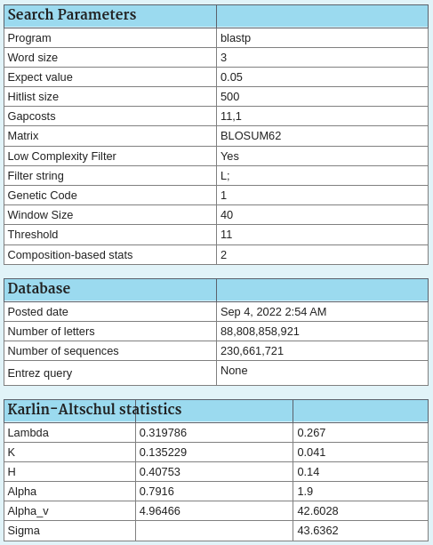

# Example sequences
## Spike protein
`20220914-SARS-CoV2-S-protein-BLAST-hits-partial.fasta`

I used NCBI blast to search the query QWE88920.1 against the refseq_protein database as of 2022-09-15. Search parameters are shown below:

I selected the top 20 hits sorted by E-value, downloaded their complete sequences as a FASTA, and imported them into Jalview. I then fetched the Uniprot record for the SARS-CoV2 spike protein (P0DTC2) and aligned all the sequences using MUSCLE within Jalview. I also fetched the 3D structure of the Uniprot entry and added the annotation via "add reference annotation" for the entry.

## Human Hemoglobin and distant homologs
`20220916-HBB-BLAST-hits-human.fasta`

Based on Barry Grant's [workshop](https://bioboot.github.io/bggn213_F22/class-material/lab-3_online_form.pdf). By aligning very distantly related homologs, we can more easily spot the highly functionally constrained (hence important) residues.

## ATP1A1
`20220917-ATP1A1-Mohammadi-and-Yang-2021-Curr-Biol.fasta`

Alignment downloaded from the [DRYAD site](https://datadryad.org/stash/downloads/file_stream/672545) for the following paper:

Mohammadi, Shabnam, Lu Yang, Arbel Harpak, Santiago Herrera-Álvarez, María Del Pilar Rodríguez-Ordoñez, Julie Peng, Karen Zhang, et al. “Concerted Evolution Reveals Co-Adapted Amino Acid Substitutions in Na+K+-ATPase of Frogs That Prey on Toxic Toads.” Current Biology: CB 31, no. 12 (June 21, 2021): 2530-2538.e10. https://doi.org/10.1016/j.cub.2021.03.089.

I fetched the uniprot sequence record for the sheep reference sequence, which is referenced in Fig 1 of the paper but not included in the alignment file. The Uniprot ID for the record is [P04074](https://www.uniprot.org/uniprotkb/P04074/entry). Note that the residue number referenced in the figure starts from 6 not 1 in the P04074 sequence. The first five residues are annotated as "propeptide", which is cleaved in the mature protein and is probably why they were not included in the numbering.

This example can be used to illustrate how MSA can be used to reveal complex evolutionary processes.
